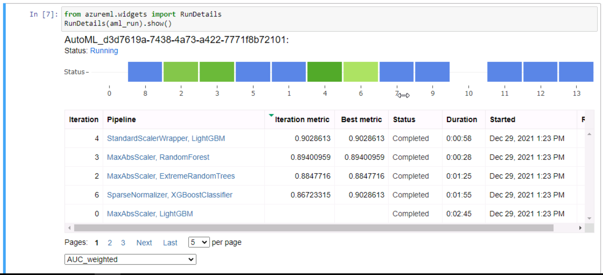

<!-- https://imthenachoman.github.io/nGitHubTOC/ --> 
- [Udacity AZ ML Engineering Nanodegree - Capstone Project](#udacity-az-ml-engineering-nanodegree---capstone-project)
  - [Introduction](#introduction)
  - [Dataset](#dataset)
    - [Overview](#overview)
    - [Task](#task)
    - [Access](#access)
  - [Automated ML](#automated-ml)
    - [Results](#results)
      - [AutoML Run Details widget](#automl-run-details-widget)
      - [AutoML Best Model Run](#automl-best-model-run)
  - [HyperDrive Model](#hyperdrive-model)
    - [Results](#results-1)
      - [HyperDrive Run Details widget](#hyperdrive-run-details-widget)
      - [HyperDrive Best Model Run](#hyperdrive-best-model-run)
  - [Model Deployment](#model-deployment)
      - [Healthy / Active Deployment](#healthy--active-deployment)
  - [Possible Improvements](#possible-improvements)
  - [Screen Recording](#screen-recording)
# Udacity AZ ML Engineering Nanodegree - Capstone Project


## Introduction
This folder contains the final project neccessary to complete Udacity's **Machine Learning Engineer with Microsoft Azure Nanodegree**. 

In this project I'll be using a dataset consisting of heart failure records freely available under this link:
[Heart Failure Data](https://archive.ics.uci.edu/ml/datasets/Heart+failure+clinical+records#). 
The data contains health records on 299 patients. In a total of 11 variables such as age and gender an individual's health condition is displayed. In a further variable info on wether the patient died shortly after assessing health is given. Effectively, the task chosen for this project is classifying patients as individuals with a high risk of fatal heart failure in before the event takes place. Subsquentely, a REST API endpoint is created to enable the use of the model for evaluations.

Two approaches are presented to showcase Azure's capabilities:
1) an automated technique using **Azure AutoML** and
2) a hypertuned LOGIT model empploying **Azure's HyperDrive** hyperparameter tuning solution.

## Dataset
The dataset used consists of heart failure records freely available under this link:
[Heart Failure Data](https://archive.ics.uci.edu/ml/datasets/Heart+failure+clinical+records#). 
The data contains health records on 299 patients. In a total of 11 variables such as age and gender an individual's condition is displayed. In a further variable info on wether the patient died shortly after assessing health is given.
### Overview

Below, the data dictionary is provided.

Index | Variable | Description
------------ | ------------- | -------------  
 0 |   age     |                  age of the patient (years)
 1 |  anaemia     |              decrease of red blood cells or hemoglobin (boolean)  
 2 |  creatinine_phosphokinase | level of the CPK enzyme in the blood (mcg/L)  
 3 |  diabetes                  |if the patient has diabetes (boolean)  
 4 |  ejection_fraction         |percentage of blood leaving the heart at each contraction (percentage)  
 5 |  high_blood_pressure       |if the patient has hypertension (boolean)  
 6 |  platelets                | platelets in the blood (kiloplatelets/mL)
 7 |  serum_creatinine         | level of serum creatinine in the blood (mg/dL)
 8 |  serum_sodium             | level of serum sodium in the blood (mEq/L)  
 9 |  sex                       |woman or man (binary) 
 10|  smoking                  | if the patient smokes or not (boolean) 
 11|  time                     | follow-up period (days)  
 12|  DEATH_EVENT              | if the patient deceased during the follow-up period (boolean, **target**)


### Task
 The task chosen for this project is classifying patients as individuals with a high risk of fatal heart failure in before the event takes place. Subsequentely, a REST API endpoint to enable the use of the model for evaluations is created.

Two approaches are presented to showcase Azure's capabilities:

1) *AZ AutoML*
  
    Automated technique using Azure AutoML. Automatically does featurization and scaling, employs different algorithms, and lets you use the best performing one according to a metric that you have set. 


2) *AZ HyperDrive*

    A method to hypertune a specific machine learning algorithm without using automatic featurization and scaling. In this project, a LOGIT model as provided by ScikitLearn is picked. All provided features are used as regressors and are furthermore not scaled.

### Access

The data itself is loaded directly from the UCI Machine Learning repo and can be accessed under this link: [Heart Failure Data](https://archive.ics.uci.edu/ml/datasets/Heart+failure+clinical+records#).
After loading the data from inside a AZ notebook, the dataset is registered under the current AZ workspace to enable further use.
The following code snippet serves as a short description of the process.
```python
    data = 'https://archive.ics.uci.edu/ml/machine-learning-databases/00519/heart_failure_clinical_records_dataset.csv'
    # load data
    dataset = Dataset.Tabular.from_delimited_files(data)
    # register data
    dataset = dataset.register(workspace=some_ws,
                               name=some_dataset_name,
                               description=some_description)
```


## Automated ML

Providing a short yet descriptive overview of the settings and configurations used in the AZ AML run, the specifications as used in setting up Azure's AutoML are given below.
```python
# AutoML settings
automl_settings = {"max_concurrent_iterations": 9,  # max possible number of concurrent possible runs. Since the used compute cluster has 10 nodes, we can use 9 concurrently (= 9 exp + 1 parent)
                   "primary_metric" : 'AUC_weighted' # metric used to assess performance of a run
}
project_folder = './aml-heart-failure'

# AutoML configuration
automl_config = AutoMLConfig(compute_target=compute_target,   # compute to run experiment
                             task = "classification",         # tpye of ML problem to solve
                             experiment_timeout_minutes = 20, # fixed timeout in minutes
                             training_data=dataset,           # dataset used
                             label_column_name="DEATH_EVENT", # target column  
                             path = project_folder,           # path to AZ ML project
                             enable_early_stopping= True,     # enabling stoppage of experiment if performance deteriorates during subsequent runs
                             featurization= 'auto',           # additional feature creation automated
                             debug_log = "aml-error-log.log", # log file writte to allow debugging
                             **automl_settings)               # dictionary of further kargs
```

### Results
After 100 runs, the best model according to the primary metric was a **Voting Ensemble** algorithm which relies on a linear combination of "child" estimators. The respective rounded **weighted AUC** was **91,78%**. The specific ID of the model can be seen here:


As the model employed 9 different models, elaborating on all settings would result in a description too verbose for this summary. However, the attached `automl.ipynb` notebook contains a detailed description on all parameters for interested viewers.

Azure moreover provides a handy visual description of what is going on under the hood while executing the experiment. This info can be accessed using the run details widget as for instance seen displayed in this project:

#### AutoML Run Details widget



#### AutoML Best Model Run
Among other things, AZ also provides a useful GUI to have a look at different experiments:


Azure also displays the parameters of the best model. As displaying all parameters of all underlying models would take up a lot of space, only a quick impression is provided in the following screenshot. The full details can be seen in the attached jupyter notebook, however.


## HyperDrive Model
As an alternative to the automated approach, a LOGIT model as provided by ScikitLearn was furthermore estimated using the same data. all provided features are used as regressors and are furthermore not scaled.
Logistic regression is a rather uncomplicated and easy-to-interpret classification technique. As such it lends itself perfectly for this project as the focus was more on using Azure's capabilities for machine learning & deployment.

As stated above, we will classify individuals as being likely to die in the next period by employing SKLearn's LOGIT model.
Additionally,hyperparameters of the model will be tuned using Azure's HyperDrive.

Specifically, 2 hyperparameters will be tuned - `C` & `max_iter`:
- `C`:     &emsp; &emsp; &emsp;    regularization (the lower, the higher the regularization), and
- `max_iter`:  maximum number of iteration rounds permitted.

The sampling of these 2 hyperparameters happened randomly.
However, whereas `C` is chosen from a uniform distribution covering the interval [0.001, 1.0], `max_iter` is chosen from the set {100, 1000, 20000}.

Anticipating a imbalanced classes, the **weighted AUC** will be used as a metric for tuning.

To save on resources, an early stopping policy was furthermore incorporated.
Specifically, the Bandit Policy was first be applied after 19 iterations.
See e.g. https://azure.github.io/azureml-sdk-for-r/reference/bandit_policy.html  for more info. 
### Results
Once hypertuned, the optimal parameters for `C` and `max_iter` where given as:

- `C`: &emsp; &emsp; &emsp; 0.8980307209925704, and
- `max_iter`: 100.

Surprisingly enough, with a **weighted AUC** of **93,875%** the hypertuned model performed better than the best one provided via AZ AutoML. Yet the hypertuned LOGIT's **Accuracy** of roughly **83%** was slighlty lower than the autotuned model - albeit by not even by **1%**.

To further improve the hypertuned model's performance, scaling the data as well as using a finer hyperparameter space seems promising.

#### HyperDrive Run Details widget


#### HyperDrive Best Model Run


## Model Deployment
After successfull estimation, both models had been deployed using an endpoint which could be accessed via REST API.

The format both models expect is JSON. As both models further make use of the same training data, they both expect the same input. As such, the following snippet serves as a examplatory filled-in mask for both: 

```json
"data":
        [
            {
            "age": 75,
            "anaemia": 1,
            "creatinine_phosphokinase": 582,
            "diabetes": 0,
            "ejection_fraction": 17,
            "high_blood_pressure": 0,
            "platelets": 265000,
            "serum_creatinine": 3,
            "serum_sodium": 127,
            "sex": 1,
            "smoking": 0,
            "time": 5
            }
      ]
```

To acquire predictions one has to trigger the mentioned endpoint. Fortunately, Azure provides a rather convenient way to do so as each ML endpoint comes with an auto-generated code snippet to consume the deployed model - e.g. for the case at hand:

```python
import urllib.request
import json
import os
import ssl

def allowSelfSignedHttps(allowed):
    # bypass the server certificate verification on client side
    if allowed and not os.environ.get('PYTHONHTTPSVERIFY', '') and getattr(ssl, '_create_unverified_context', None):
        ssl._create_default_https_context = ssl._create_unverified_context

allowSelfSignedHttps(True) # this line is needed if you use self-signed certificate in your scoring service.

# Request data goes here
data = {
    "Inputs": {
        "data":
        [
            {
                'age': "70",
                'anaemia': "1",
                'creatinine_phosphokinase': "582",
                'diabetes': "0",
                'ejection_fraction': "17",
                'high_blood_pressure': "0",
                'platelets': "265000",
                'serum_creatinine': "3",
                'serum_sodium': "127",
                'sex': "0",
                'smoking': "0",
                'time': "5",
            },
        ],
    },
    "GlobalParameters": {
    }
}

  
body = str.encode(json.dumps(data))

url = 'http://10334fe6-8145-4cab-856b-7f0e2bfc0211.southcentralus.azurecontainer.io/score'
api_key = '' # Replace this with the API key for the web service; here: no key
headers = {'Content-Type':'application/json', 'Authorization':('Bearer '+ api_key)}

req = urllib.request.Request(url, body, headers)

try:
    response = urllib.request.urlopen(req)

    result = response.read()
    print(result)
except urllib.error.HTTPError as error:
    print("The request failed with status code: " + str(error.code))

    # Print the headers - they include the requert ID and the timestamp, which are useful for debugging the failure
    print(error.info())
    print(json.loads(error.read().decode("utf8", 'ignore')))
```


#### Healthy / Active Deployment

As mentioned, both models have been deployed. Below screenshots of the deployment can be found starting with the AutoML service.


## Possible Improvements

To further improve upon the achieved performance, different options come to mind.
For one, when addressing the hypertuned model scaling the data as well as using a finer hyperparameter space seems promising.
Furthermore, applying deep learning algorithms might also be a worthwile undertaking.
Additionally, one might also look for stronger regressors.


## Screen Recording

Link to recording:  https://youtu.be/fBoHwzUeV1o